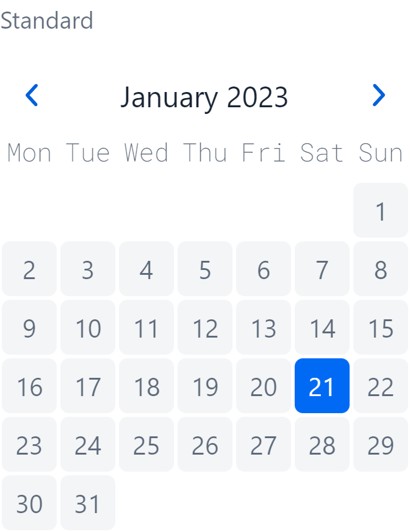

# MiniCalendar

`MiniCalendar` is a [server-only](https://github.com/vaadin/addon-starter-flow) Vaadin component for displaying and
selecting `LocalDate` values.

|                                              The *sunny* side 🌞                                              |                                          The *dark* side (of the moon 🌒)                                          |
|:-------------------------------------------------------------------------------------------------------------:|:------------------------------------------------------------------------------------------------------------------:|
|  |  |

## Fundamentals
The internals are built on the [Java Time API](https://docs.oracle.com/javase/8/docs/api/java/time/package-summary.html)
, the displayed values are localized with the locale that is set for the current UI.

The component implements the `LocaleChangeObserver`. It listens for locale changes and will redraw itself when the
locale has changed.

## Features

### Single Value Selection
The Component is designed to have a single value selected. It implements the `HasValue`
interface and can therefore be used with a `Binder` like any other default Vaadin field.

You can listen to value changes as well as `YearMonth` changes which will be triggered when
the user navigates through the months *or* the component gets a new value set which differs
from the previous `YearMonth` value.

```java
val miniCalendar = new MiniCalendar();

miniCalendar.addValueChangeListener(event -> {
    Notification.show("Value changed to " + event.getValue());
});

miniCalendar.addYearMonthChangeListener(event -> {
    Notification.show("Value changed to " + event.getValue());
});
```

When adding a listener you'll get an instance of `Registration` back that which can be used
to remove said listener again.

```java
var registration = miniCalendar.addYearMonthChangeListener(...);

registration.remove();
```


